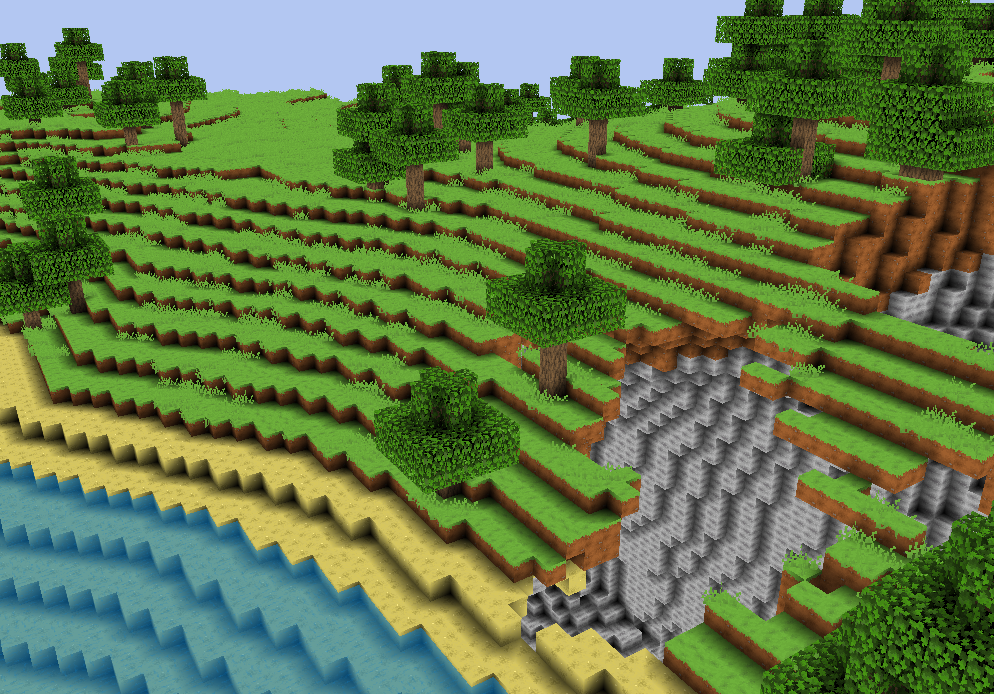
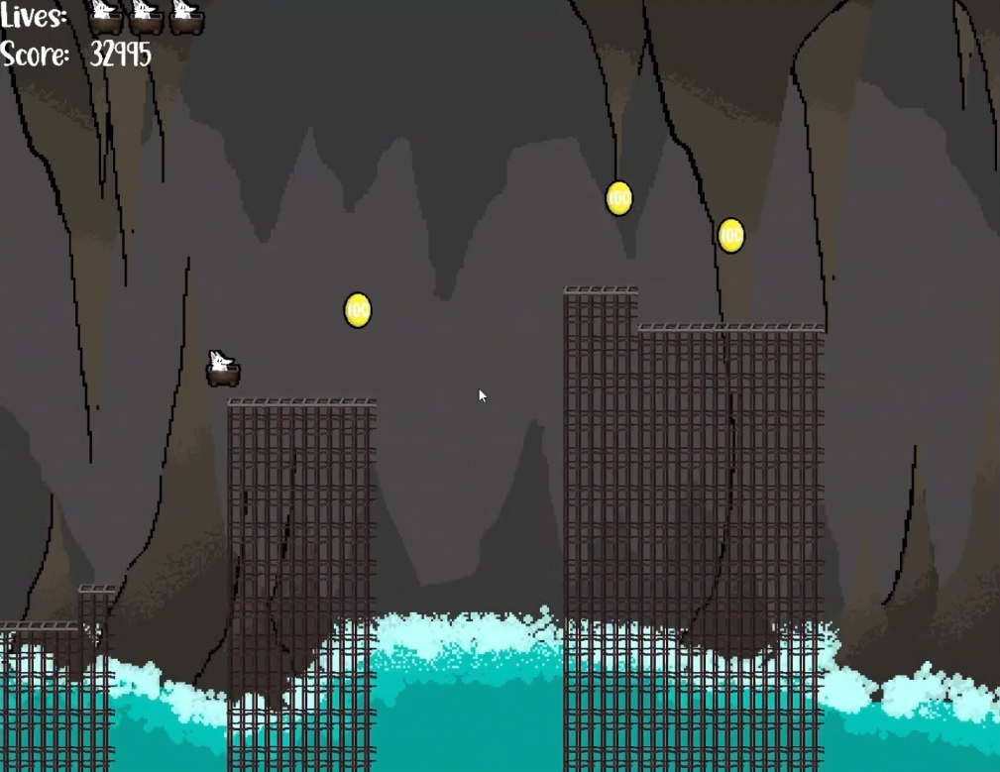
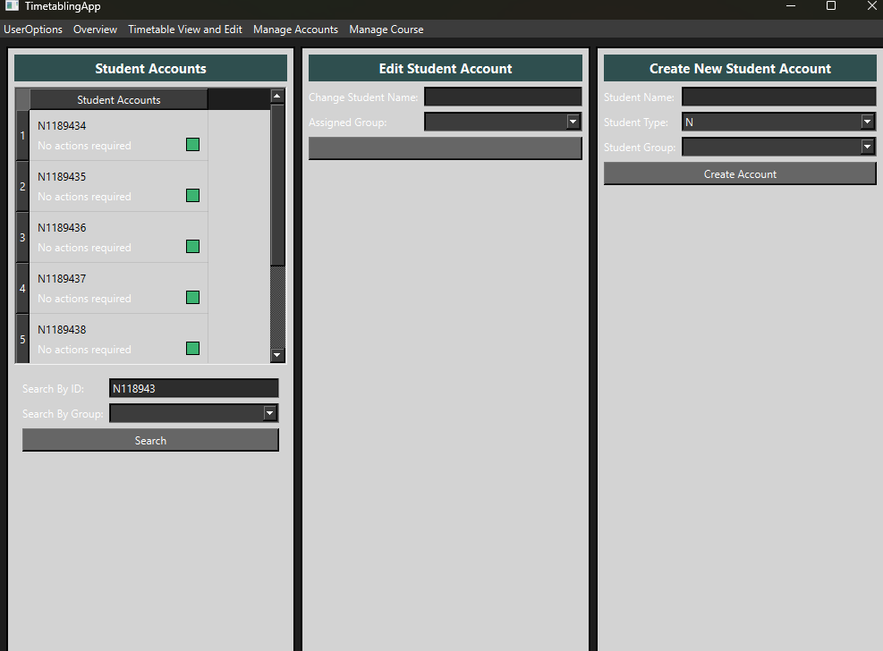

## Hello!
#### Thanks For Visiting My Profile!

I am a Third-Year Computer Science student, who has a particular enjoyment in games programming, 
especially in C++ with OpenGL and SDL. But my interests also extend into the wider field of
software development, and I am always looking to learn more.

Below, I have pinned some of my current best / most notable projects - a combination of personal
and university coursework. Where possible, clips of these projects in action have been linked to 
view via YouTube, with the Channel itself accessible [here](https://www.youtube.com/@MisterPuggsProgramming).

## Personal Projects

## A 3D Minecraft-Style Game built with C++ and OpenGL

#### [Repository Link](https://github.com/CEWilkie/Voxel-Game-OpenGL)
A simple minecraft-styled game featuring a procedurally generated interactible environment in
16x16x256 block chunks. Developed primarily over Summer-Spring of 2024-2025, its continued work
has now halted in favour of developing a proper 3D voxel-based game engine from the ground up.

Whilst that project is not able to be displayed publicly yet, hopefully the existing project will 
give visitors some insight into where I began.

## Coursework / University Projects

## A Junimo-Kart inspired Platformer Game

#### [Repository Link](https://github.com/CEWilkie/SDL-Platformer-Game)
Inspired by the Junimo Kart minigame found in Stardew Valley, I decided to recreate it for my first real 
attempt at games programming. It features randomly generated levels, with collectables, obstacles and
checkpoints. Whilst I would now consider the code behind it of an abysmally poor standard, it does work!

## Student/Staff Timetabling Application 

#### [Repository Link](https://github.com/CEWilkie/TimetablingApp)
A C++ application that interacts with a local sqlite database to register student and staff accounts, and
create and assign lessons for modules to students. Originally intended to use a GUI via Qt, this
would be dropped for the later versions. Still uses the Qt Test Framework.

## Docker-Network based load balancing system

#### [Repository Link](https://github.com/CEWilkie/DockerLoadBalancer)
An application made using Java, to simulate delayed file transfers over a load-balanced network.
Users would interface through a JavaFX Portal, with the network was simulated via a Docker Network. 
Additionally featured a MySQL server, and local sqlite database.

## Predicting High-Income Developers using their Characteristics

#### [Repository Link](https://github.com/CEWilkie/SOAS2024_MachineLearning)
This report aimed to produce and compare the effectiveness of Machine Learning models in predicting
high-income developers, based upon their characteristics and responses to the 2024 Stack Overflow
Annual Developer Survey.

The report contains the full process of the CRISP-DM flow, from Data cleaning to model refinement and
comparison. Models produced would reach accuracies of over 80%, using characteristics such as Industry, 
Years of work experience and education level.

## Workshops

I have also hosted workshops aimed at First-Year Students, to provide assistance with the foundations of 
Python and C++.

[Python Workshop Repository 2024](https://github.com/CEWilkie/FYPythonWorkshop_27.11.2024)

[C++ Workshop Repository 2025](https://github.com/CEWilkie/FYCPPWorkshop05-03)

### How To Reach Me
If for any reason you wish to contact me, you can:
- message me on [LinkedIn](https://www.linkedin.com/in/callumwilkie2005/)
- email me via `cew05@outlook.com`

